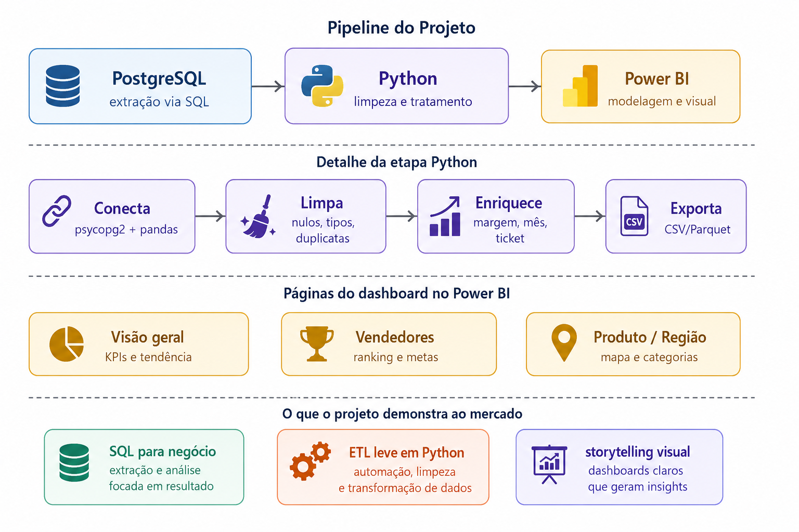
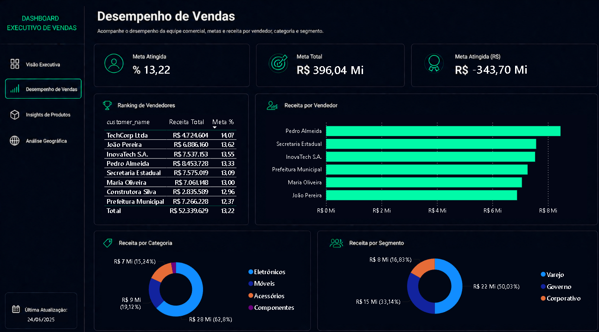

# Executive Sales Dashboard

**[Português](#português) • [English](#english)**


---

## Português

Dashboard comercial completo construído com pipeline de três camadas: extração via SQL, tratamento via Python e visualização via Power BI. O projeto simula o ambiente de dados de uma empresa de varejo fictícia e entrega um painel executivo com quatro páginas analíticas prontas para apresentação a um diretor comercial.

O diferencial desse projeto em relação a um dashboard comum está no processo: antes de qualquer linha de código, foram levantados requisitos funcionais e não funcionais, regras de negócio explícitas e casos de teste automatizados com `pytest`. Nenhuma métrica chegou ao Power BI sem ter sido validada.

### Fluxograma do pipeline



### Dashboard



### As quatro páginas

**Página 1 — Executive Overview**

A página que responde a pergunta principal: como a empresa está indo? Contém os quatro KPIs principais (receita total, margem, ticket médio e crescimento mês a mês), evolução da receita ao longo do tempo, comparativo de meta versus receita realizada, receita por região, top produtos e top vendedores. Slicers de ano, região, segmento e categoria sincronizados com as demais páginas.

**Página 2 — Sales Performance**

Voltada para análise de vendas. Ranking de vendedores por receita, percentual de atingimento de meta por vendedor, receita por categoria de produto e receita por segmento de cliente. Inclui botão de navegação para retorno ao Overview.

**Página 3 — Product Insights**

Análise aprofundada de produtos. Treemap de participação por categoria, top 10 produtos por receita, gráfico de dispersão receita versus margem, ticket médio por categoria e participação percentual de cada categoria no total.

**Página 4 — Geographic Analysis**

Mapa do Brasil com receita por estado, cards de destaque com maior estado por receita, maior margem e estado mais lucrativo, e heatmap de intensidade geográfica de vendas.

### Requisitos funcionais atendidos

| ID | Requisito |
|---|---|
| RF01 | Extração via SQL com joins resolvidos no banco |
| RF02 | Exclusão de pedidos cancelados e devolvidos |
| RF03 | Cálculo de receita, custo e margem por pedido |
| RF04 | Percentual de atingimento de meta mensal por vendedor |
| RF05 | Filtros sincronizados por período, região e segmento |
| RF06 | Ranking de vendedores por receita |
| RF07 | Comparação de receita mês a mês |
| RF08 | Arquivo de saída tratado para consumo do Power BI |

### Requisitos não funcionais atendidos

| ID | Requisito |
|---|---|
| RNF01 | Extração SQL em menos de 5 segundos |
| RNF02 | Pipeline idempotente — mesma saída em execuções repetidas |
| RNF03 | Logging estruturado por etapa |
| RNF04 | CSV em UTF-8 com BOM para acentuação no Power BI Windows |
| RNF05 | Ambiente reproduzível via Docker |
| RNF06 | Margem calculada no Python — fonte única de verdade |
| RNF07 | Credenciais via variáveis de ambiente, nunca no código |

### Regras de negócio

- Pedido cancelado ou devolvido não entra em nenhuma métrica de receita
- Margem é calculada sobre o preço efetivamente cobrado, não sobre o preço de tabela
- Atingimento de meta é sempre relativo ao mês da venda, não ao mês corrente
- Vendedor sem meta cadastrada retorna nulo no atingimento, sem quebrar o pipeline
- Cliente pertence a um único segmento: Varejo, Corporativo ou Governo

### Testes automatizados

Sete casos de teste cobrem as regras de negócio antes da exportação para o Power BI:

```
TC01 — pedido cancelado é excluído
TC02 — revenue = sale_price × quantity
TC03 — margin e margin_pct sobre o preço efetivo
TC04 — vendedor sem meta não gera exceção
TC05 — atingimento consistente para pedidos do mesmo mês
TC06 — tipos corretos na saída (float, datetime, sem object)
TC07 — pipeline idempotente em execuções repetidas
```

### Arquitetura

```
PostgreSQL 15 (persistência)
    ↓ SQL com joins — salespeople, products, customers, orders
Python 3.11 (processamento)
    ↓ clean_data()   — remove cancelados, garante tipos
    ↓ enrich_data()  — revenue, margin, goal_attainment_pct
    ↓ pytest         — valida 7 casos de teste
    ↓ export()       — CSV UTF-8-sig
Power BI Desktop (apresentação)
    ↓ tabela calendário
    ↓ medidas DAX — MoM, ranking, metas
    ↓ 4 páginas com slicers sincronizados
```

### Tecnologias

| Tecnologia | Uso |
|---|---|
| PostgreSQL 15 | banco transacional de origem |
| Python 3.11 | extração, tratamento e enriquecimento |
| pandas 2.2 | manipulação e cálculo de métricas |
| pytest | testes automatizados das regras de negócio |
| python-dotenv | credenciais via variáveis de ambiente |
| Power BI Desktop | modelagem DAX e visualização |
| Docker Compose | ambiente reproduzível do banco |

### Estrutura do projeto

```
sales-dashboard/
├── sql/
│   ├── create_tables.sql
│   └── seed_data.sql
├── etl/
│   ├── config.py
│   └── extract_transform.py
├── tests/
│   └── test_business_rules.py
├── data/
│   └── sales_clean.csv
├── dashboard/
│   └── sales_dashboard.pbix
├── images/
│   ├── Fluxograma.png
│   └── Print.png
├── docker-compose.yml
├── requirements.txt
├── .env
└── README.md
```

### Como rodar

**Pré-requisitos:** Docker, Python 3.11 e Power BI Desktop instalados.

```bash
git clone https://github.com/yagosalcastanho/sales-dashboard.git
cd sales-dashboard

python -m venv venv
source venv/bin/activate        # Windows: venv\Scripts\activate
pip install -r requirements.txt
```

Cria o arquivo `etl/.env`:
```
DB_HOST=localhost
DB_PORT=5436
DB_NAME=sales_dashboard_db
DB_USER=dash_user
DB_PASSWORD=dash_pass
```

Sobe o banco:
```bash
docker compose up -d
```

Roda os testes:
```bash
pytest tests/ -v
```

Roda o pipeline:
```bash
cd etl
python extract_transform.py
```

Abre `dashboard/sales_dashboard.pbix` no Power BI Desktop e atualiza a fonte apontando para `data/sales_clean.csv`.

---

## English

A complete commercial sales dashboard built with a three-layer pipeline: SQL extraction, Python processing and Power BI visualization. The project simulates the data environment of a fictional retail company and delivers an executive panel with four analytical pages ready for presentation to a commercial director.

What sets this project apart from a typical dashboard is the process: before any line of production code, functional and non-functional requirements were defined, explicit business rules were documented, and automated test cases were written with `pytest`. No metric reached Power BI without being validated first.

### Pipeline flowchart


### Dashboard


### The four pages

**Page 1 — Executive Overview**

The page that answers the main question: how is the company doing? Contains the four main KPIs (total revenue, margin, average ticket and month-over-month growth), revenue trend over time, target vs actual revenue comparison, revenue by region, top products and top salespeople. Year, region, segment and category slicers synchronized across all pages.

**Page 2 — Sales Performance**

Focused on sales analysis. Salesperson ranking by revenue, goal attainment percentage per salesperson, revenue by product category and revenue by customer segment. Includes a navigation button to return to the Overview.

**Page 3 — Product Insights**

In-depth product analysis. Category participation treemap, top 10 products by revenue, revenue versus margin scatter chart, average ticket by category and percentage share of each category in the total.

**Page 4 — Geographic Analysis**

Map of Brazil with revenue by state, highlight cards for top state by revenue, highest margin and most profitable state, and a geographic sales intensity heatmap.

### Functional requirements covered

| ID | Requirement |
|---|---|
| RF01 | SQL extraction with joins resolved in the database |
| RF02 | Exclusion of cancelled and returned orders |
| RF03 | Revenue, cost and margin calculation per order |
| RF04 | Monthly goal attainment percentage per salesperson |
| RF05 | Synchronized filters by period, region and segment |
| RF06 | Salesperson ranking by revenue |
| RF07 | Month-over-month revenue comparison |
| RF08 | Treated output file for Power BI consumption |

### Non-functional requirements covered

| ID | Requirement |
|---|---|
| RNF01 | SQL extraction under 5 seconds |
| RNF02 | Idempotent pipeline — same output on repeated runs |
| RNF03 | Structured logging per stage |
| RNF04 | CSV in UTF-8 with BOM for accent compatibility on Power BI Windows |
| RNF05 | Reproducible environment via Docker |
| RNF06 | Margin calculated in Python — single source of truth |
| RNF07 | Credentials via environment variables, never in source code |

### Business rules

- Cancelled or returned orders are excluded from all revenue metrics
- Margin is calculated on the effective sale price, not the list price
- Goal attainment is always relative to the order month, not the current month
- A salesperson without a registered goal returns null in attainment without breaking the pipeline
- A customer belongs to a single segment: Retail, Corporate or Government

### Automated tests

Seven test cases cover the business rules before export to Power BI:

```
TC01 — cancelled order is excluded
TC02 — revenue = sale_price × quantity
TC03 — margin and margin_pct on the effective price
TC04 — salesperson without goal does not raise an exception
TC05 — attainment consistent for orders in the same month
TC06 — correct types in output (float, datetime, no object)
TC07 — idempotent pipeline on repeated runs
```

### Architecture

```
PostgreSQL 15 (persistence)
    ↓ SQL with joins — salespeople, products, customers, orders
Python 3.11 (processing)
    ↓ clean_data()   — removes cancelled, enforces types
    ↓ enrich_data()  — revenue, margin, goal_attainment_pct
    ↓ pytest         — validates 7 test cases
    ↓ export()       — CSV UTF-8-sig
Power BI Desktop (presentation)
    ↓ calendar table
    ↓ DAX measures — MoM, ranking, targets
    ↓ 4 pages with synchronized slicers
```

### Technologies

| Technology | Purpose |
|---|---|
| PostgreSQL 15 | source transactional database |
| Python 3.11 | extraction, cleaning and enrichment |
| pandas 2.2 | data manipulation and metric calculation |
| pytest | automated business rule tests |
| python-dotenv | credentials via environment variables |
| Power BI Desktop | DAX modeling and visualization |
| Docker Compose | reproducible database environment |

### Project structure

```
sales-dashboard/
├── sql/
│   ├── create_tables.sql
│   └── seed_data.sql
├── etl/
│   ├── config.py
│   └── extract_transform.py
├── tests/
│   └── test_business_rules.py
├── data/
│   └── sales_clean.csv
├── dashboard/
│   └── sales_dashboard.pbix
├── Fluxograma/
│   └── fluxograma.png
├── Print/
│   └── dashboard.png
├── docker-compose.yml
├── requirements.txt
├── .env
└── README.md
```

### How to run

**Prerequisites:** Docker, Python 3.11 and Power BI Desktop installed.

```bash
git clone https://github.com/yagosalcastanho/sales-dashboard.git
cd sales-dashboard

python -m venv venv
source venv/bin/activate        # Windows: venv\Scripts\activate
pip install -r requirements.txt
```

Create the `etl/.env` file:
```
DB_HOST=localhost
DB_PORT=5436
DB_NAME=sales_dashboard_db
DB_USER=dash_user
DB_PASSWORD=dash_pass
```

Start the database:
```bash
docker compose up -d
```

Run the tests:
```bash
pytest tests/ -v
```

Run the pipeline:
```bash
cd etl
python extract_transform.py
```

Open `dashboard/sales_dashboard.pbix` in Power BI Desktop and refresh the data source pointing to `data/sales_clean.csv`.

---

### Contributing | Contribuindo

Contributions are more than welcome. Fork the project, create a branch, commit your changes and open a pull request. Maybe you know something that I don´t know :). Contribuições são mais que bem-vindas. Faça um fork, crie uma branch, commite suas alterações e abra um pull request; talvez você saiba de algo que eu não sei :).

### License | Licença

Distributed under the MIT License.
Distribuído sob a licença MIT.

---

<div align="center">
  Developed as a Data Analytics portfolio project<br>
  Desenvolvido como projeto de portfólio de Análise de Dados
</div>
ENDOFFILE
